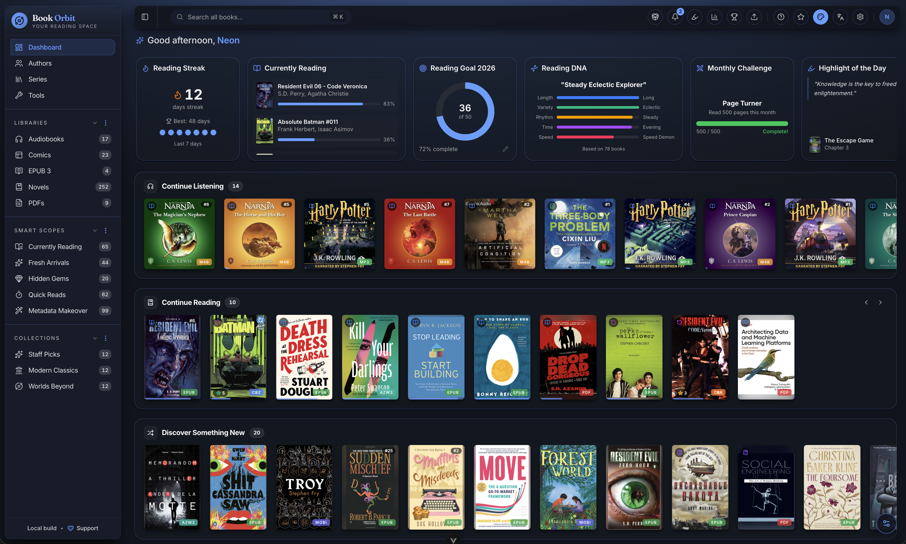
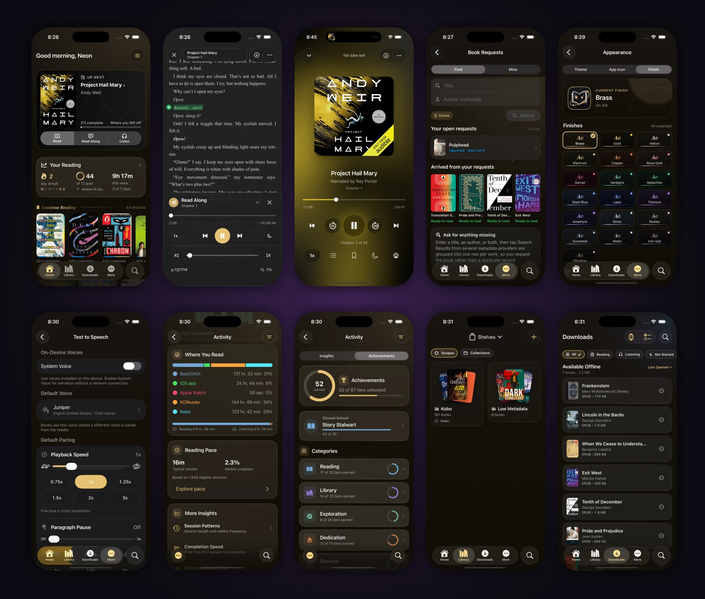
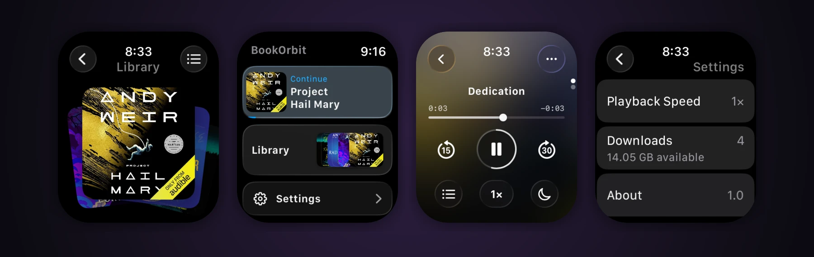
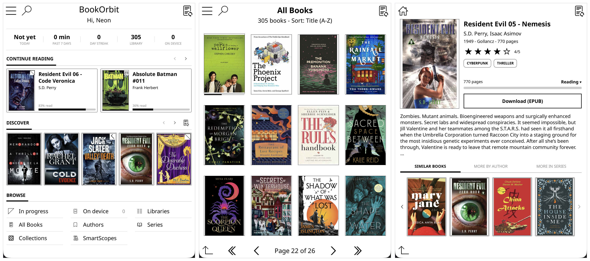

<div align="center">

<h1>
  <br>
  BookOrbit
</h1>

A self-hosted library and reading platform for ebooks, PDFs, audiobooks, and comics.

Copyright (C) 2025-2026 neon and BookOrbit contributors.

[](https://github.com/bookorbit/bookorbit/releases)
[](https://github.com/bookorbit/bookorbit/stargazers)
[](https://github.com/bookorbit/bookorbit/actions/workflows/ci.yml)
[](https://github.com/bookorbit/bookorbit/actions/workflows/release.yml)
[](https://codecov.io/gh/bookorbit/bookorbit)
[](https://crowdin.com/project/bookorbit)

[](https://bookorbit.app)
[](https://demo.bookorbit.app/magic?token=2d92cb900e184cf0eb8b11f72cffc6011673d1016e1b300d750eb3d76abc1572)
[](https://apps.apple.com/us/app/bookorbit-the-official-app/id6811807346)
[](https://github.com/bookorbit/bookorbit/pkgs/container/bookorbit)
[](https://github.com/bookorbit/bookorbit/blob/main/docs/CONTRIBUTING.md)



</div>

---

## What is BookOrbit?

**[BookOrbit](https://bookorbit.app)** organizes your books and lets you enjoy them anywhere: on iPhone, Apple Watch, the web, Kobo, or KOReader. Your reading progress, highlights, and status stay synchronized, so you can start a chapter in one place and continue in another.

Around that core sit 14 metadata providers, reading statistics and achievements, OPDS and Send-to-Kindle delivery, multi-user accounts with OIDC/SSO, and automatic sync out to Hardcover, Readwise, and StoryGraph. All of it runs on infrastructure you control.

[](https://bookorbit.app)

## BookOrbit for iPhone and Apple Watch

Take your library anywhere with the official native BookOrbit app. Read ebooks, PDFs, and comics; stream or download audiobooks; use text to speech; and keep reading offline. The app connects directly to your self-hosted BookOrbit server, while Apple Watch brings downloaded audiobooks and synchronized playback progress to your wrist.


<div align="center">

<a href="https://apps.apple.com/us/app/bookorbit-the-official-app/id6811807346"></a>

<sub>Requires BookOrbit v3.0.0 or later and iOS 26 or later. Apple Watch features require watchOS 26 or later.</sub>

</div>

<details>
<summary><strong>Explore all 14 screenshots</strong></summary>

### iPhone



### Apple Watch



</details>

## Live Demo

Try the live instance before you install. No account required.

[](https://demo.bookorbit.app/magic?token=2d92cb900e184cf0eb8b11f72cffc6011673d1016e1b300d750eb3d76abc1572)

> **Note:** The demo includes a sample library of public domain books. Some administrative features are limited in the public demo. Self-hosting BookOrbit provides the full experience.

## Features

### Reading Experience & Sync

- **Built-in Web Readers**: Ebooks (EPUB, KEPUB, MOBI, AZW3, AZW, FB2), PDFs, comics (CBZ, CBR, CB7), and audiobooks (M4B, MP3, M4A, OPUS, OGG, FLAC), with no extra plugins required.
- **Native iPhone & Apple Watch Apps**: Read, listen, download, upload, and synchronize with your BookOrbit server from a native, offline-capable iPhone app. Send audiobooks to Apple Watch for independent offline playback and later progress reconciliation.
- **Three-Way Sync (Kobo + KOReader + BookOrbit)**: Progress and annotations flow bidirectionally between Kobo devices, KOReader, and the BookOrbit web reader. Pick up on any surface where you left off on another, including highlights and deletions.
- **KOReader Plugin**: An on-device catalog browser with search, download, and status and rating management, alongside full progress and annotation sync.
- **Annotations & Highlights**: Highlights from the web reader, KOReader, and Kobo merge into one searchable hub. Filter by color, style, and source; export as Markdown, CSV, or JSON.
- **Hardcover, Readwise & StoryGraph Sync**: Push status, progress, reading dates, and ratings to Hardcover on configurable triggers; status and progress to The StoryGraph; and new highlights and notes to Readwise as you create them, from both the web reader and synced devices. Hardcover read history can be pulled back to backfill blank BookOrbit entries.
- **Statistics, Goals & Achievements**: Daily reading time, heatmaps, streaks, and library health, plus yearly goals, monthly challenges, and 50+ achievements across five categories. Reading DNA profiles your reading style from your actual session history.

### Library Management

- **Multiple Libraries**: Isolate content with per-library folders, custom scan rules, and format priorities.
- **14 Metadata Providers**: Google Books, Open Library, Amazon, Goodreads, Kobo, Hardcover, Audible, Audnexus, Libro.fm, and iTunes, plus ComicVine for comics, RanobeDB for light novels, and Aladin and Lubimyczytać for Korean and Polish catalogs. Cover art is sourced separately from iTunes, DuckDuckGo, and AudiobookCovers.
- **Smart Scopes & Collections**: Organize your collection with curated lists and dynamic, rule-based saved filters.

### Platform & Delivery

- **Multi-User & SSO**: Granular per-user permissions and isolated reading data, with native support for Authentik, Keycloak, and Authelia via OIDC.
- **Multilingual Interface**: Community translations are managed on [Crowdin](https://crowdin.com/project/bookorbit). See the [localization guide](docs/LOCALIZATION.md) for current language support and contributor instructions.
- **Content Delivery**: OPDS support for compatible apps, Send-to-Kindle via email, and browser drag-and-drop uploads.
- **Automated Ingestion**: Configure a Book Dock drop folder for hands-free importing.

## Quick Start (Docker)

```bash
mkdir bookorbit && cd bookorbit
mkdir -p books data/app data/postgres
curl -fsSLo .env https://raw.githubusercontent.com/bookorbit/bookorbit/main/.env.example
curl -fsSLo docker-compose.yml https://raw.githubusercontent.com/bookorbit/bookorbit/main/docker-compose.yml
```

Edit `.env` and set these required values:

```dotenv
APP_URL=http://your-server-ip:3000   # the URL you'll open in your browser
BOOKS_HOST_PATH=./books              # folder on your server where your book files live

POSTGRES_PASSWORD=         # database password           - openssl rand -hex 24
JWT_SECRET=                # signs login tokens          - openssl rand -hex 32
SETUP_BOOTSTRAP_TOKEN=     # one-time setup wizard token - openssl rand -hex 16
```

On a NAS, or any host where your book folder is owned by a user other than UID 1000, also set `PUID` and `PGID` to match that owner. Getting these wrong is the most common cause of permission errors on first scan.

Then start:

```bash
docker compose up -d
```

Open `http://your-server-ip:3000` and complete setup using your `SETUP_BOOTSTRAP_TOKEN`.

For the full installation guide including reverse proxy setup, file permissions on NAS, secrets from mounted files, external databases, OIDC hardening, and environment variable reference, see **[bookorbit.app/installation](https://bookorbit.app/installation)**.

## How I Actually Use BookOrbit

One read-along EPUB3 per book: listened to on iPhone, carried offline to Apple Watch for runs, read
on a Kobo through KOReader, and picked up again on the laptop. One file, one reading position, no
reconciling an audiobook against an ebook.

Read the full walkthrough at **[bookorbit.app/my-workflow](https://bookorbit.app/my-workflow)**.

## KOReader Plugin

The BookOrbit plugin for KOReader adds progress sync, two-way annotation sync, and a native catalog browser: navigate, search, and download books from your library without leaving the device.



1. In BookOrbit, go to **Settings > KOReader**, create credentials if prompted, and click **Download Plugin**.
2. Unzip `bookorbit.koplugin.zip`.
3. Copy `bookorbit.koplugin` to `koreader/plugins/` on the device.
4. Restart KOReader and open a book.
5. Use **Tools > BookOrbit Sync** to connect.

The download is pre-configured with your server URL and credentials, so there is no manual entry on the device. For full setup and sync options, see **[bookorbit.app/koreader-plugin](https://bookorbit.app/koreader-plugin)**.

## Documentation and Contributing

Full documentation is at **[bookorbit.app](https://bookorbit.app/what-is-bookorbit)**, covering libraries, metadata, readers, Kobo sync, OPDS, users and permissions, OIDC setup, and more.

For setting up book requests, see the [book requests guide](docs/BOOK_REQUESTS.md): indexers,
download clients, path mappings, automation, and the encryption key they all need.
For local development, see [docs/DEVELOPMENT.md](docs/DEVELOPMENT.md). To contribute, see [docs/CONTRIBUTING.md](docs/CONTRIBUTING.md) for the full workflow: branch naming, test expectations, PR checklist, and commit format.

## Managed Hosting

Prefer a hosted instance? [Zenith offers BookOrbit hosting](https://zenith.hosting/host/bookorbit) with a web file browser for uploads, access controls, and resource usage insights.

[](https://zenith.hosting/host/bookorbit)

## Repository Activity


## Translations

Help translate BookOrbit into your language on [Crowdin](https://crowdin.com/project/bookorbit).

When adding user-facing text in code, add the Vue I18n key only to `client/src/locales/en.json`. Do not edit non-English catalogs in a feature pull request; untranslated keys fall back to English until Crowdin provides a translation. See [docs/LOCALIZATION.md](docs/LOCALIZATION.md) for the complete workflow.

[](https://crowdin.com/project/bookorbit)

## Star History

[](https://github.com/bookorbit/bookorbit/stargazers)

## Support

- **Support development:** [Open Collective](https://opencollective.com/bookorbit)
- **Questions and discussion:** [GitHub Discussions](https://github.com/bookorbit/bookorbit/discussions)
- **Bug reports:** [GitHub Issues](https://github.com/bookorbit/bookorbit/issues/new?template=bug_report.yml)
- **Feature requests:** [GitHub Issues](https://github.com/bookorbit/bookorbit/issues/new?template=feature_request.yml)
- **Security vulnerabilities:** Follow the private reporting process in the [Security Policy](.github/SECURITY.md).

## License and Attribution

BookOrbit is licensed under the **[GNU Affero General Public License v3.0 only](LICENSE)**.

BookOrbit material whose copyright holders have authorized them is also subject to the **[BookOrbit Additional Terms](ADDITIONAL_TERMS.md)** under sections 7(b), 7(c), 7(d), and 7(e) of the GNU AGPL v3. See the **[Attribution and Legal Notice](NOTICE)** for the required attribution.
